

  

<h1 align="center">Network Security Groups (NSGs) &amp; Traffic Inspection Between Azure Virtual Machines</h1>

  This project demonstrates how to deploy Azure virtual machines, analyze real network traffic using Wireshark, and control communication using Network Security Groups (NSGs). The lab focuses on understanding how systems communicate and how security rules impact network behavior.

<h2>🎯 Goals &amp; Objectives</h2>

  The goal of this project was to build a working network environment in Azure and understand how traffic flows between systems at the packet level.

By the end of this lab, I aimed to:

<ul>
  <li>Deploy multiple virtual machines in a shared network</li>
  <li>Capture and analyze traffic using Wireshark</li>
  <li>Observe key protocols (ICMP, SSH, DHCP, DNS, RDP)</li>
  <li>Apply and test Network Security Group rules</li>
  <li>Understand how security configurations affect connectivity</li>
  <li>Improve troubleshooting through direct observation</li>
</ul>

<h2>📌 Overview</h2>

  In this project, I created a Windows and Ubuntu virtual machine within the same Azure Virtual Network to simulate a basic network environment. Using Wireshark, I captured and analyzed traffic between the machines while generating different types of network activity.

  I then modified Network Security Group rules to block and allow traffic, which demonstrated how cloud-level security controls influence communication between systems.

<h2>🧰 Technologies Used</h2>

<ul>
  <li>Microsoft Azure (Virtual Machines)</li>
  <li>Network Security Groups (NSGs)</li>
  <li>Wireshark</li>
  <li>Remote Desktop Protocol (RDP)</li>
  <li>SSH</li>
  <li>PowerShell</li>
  <li>DNS</li>
  <li>DHCP</li>
  <li>ICMP</li>
</ul>

<h2>💻 Environment</h2>

<ul>
  <li>Windows 10 Virtual Machine</li>
  <li>Ubuntu Virtual Machine</li>
  <li>Azure Virtual Network (shared)</li>
  <li>Azure Subnet</li>
  <li>Network Security Group</li>
  <li>Wireshark installed on the Windows VM</li>
</ul>

<h2>⚙️ Implementation</h2>

<h3>1. Infrastructure Setup</h3>

<ul>
  <li>Created a Resource Group</li>
  <li>Deployed Windows and Ubuntu virtual machines</li>
  <li>Ensured both VMs were placed in the same Virtual Network and Subnet</li>
</ul>

  This setup allowed communication over private IP addresses within a controlled environment.

  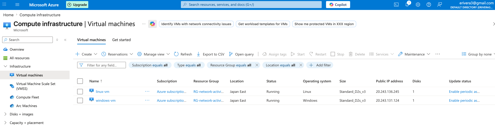

<h3>2. ICMP Traffic Observation</h3>

<ul>
  <li>Installed Wireshark on the Windows VM</li>
  <li>Captured live network traffic</li>
  <li>Generated ICMP traffic by:
    <ul>
      <li>Pinging the Ubuntu VM using its private IP address</li>
      <li>Pinging a public website such as google.com</li>
    </ul>
  </li>
</ul>

  I observed successful request and reply packets, confirming connectivity.

  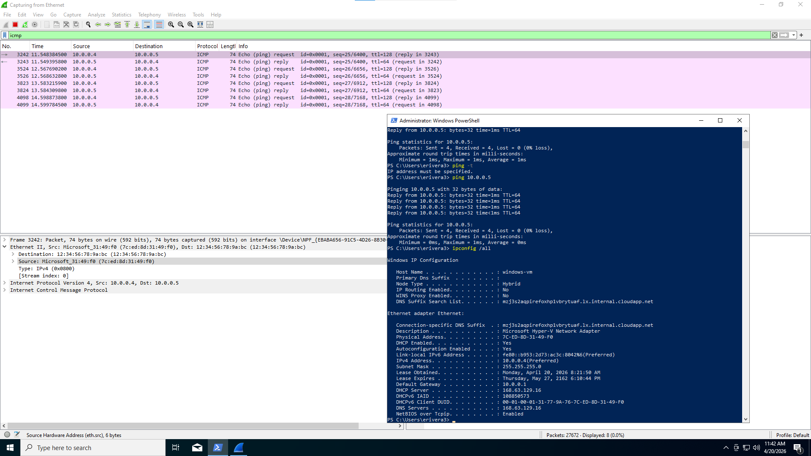

<h3>3. Network Security Group Testing</h3>

<ul>
  <li>Started a continuous ping from the Windows VM to the Ubuntu VM</li>
  <li>Applied an NSG rule to block inbound ICMP traffic</li>
  <li>Observed that requests continued while replies stopped</li>
  <li>Re-enabled ICMP traffic and confirmed that replies resumed</li>
</ul>

  Blocking ICMP stopped replies but not outgoing requests, creating one-way communication. Re-enabling the rule restored normal connectivity.

<table align="center">
  <tr>
    <td align="center">
      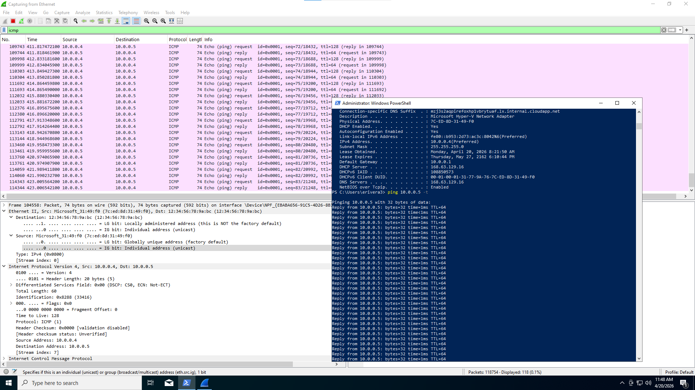 
      Before NSG Rule (Working)
    </td>
    <td align="center">
      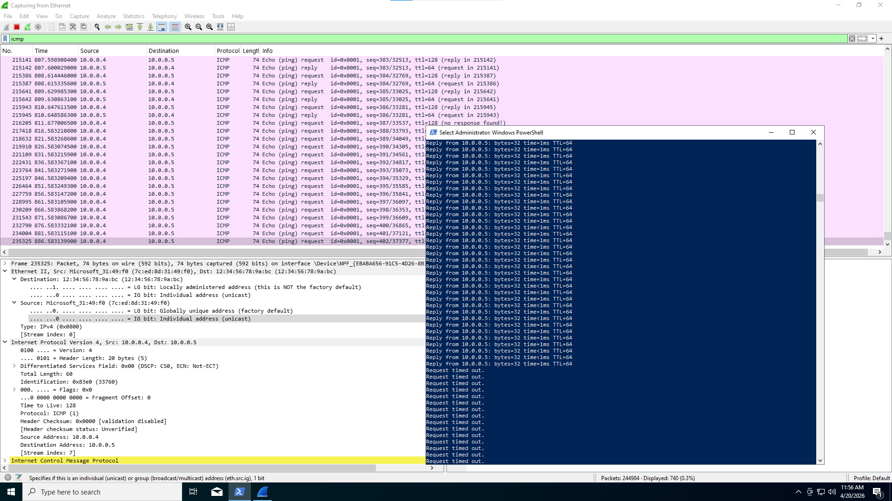 
      After NSG Rule (Blocked)
    </td>
  </tr>
</table>

 

  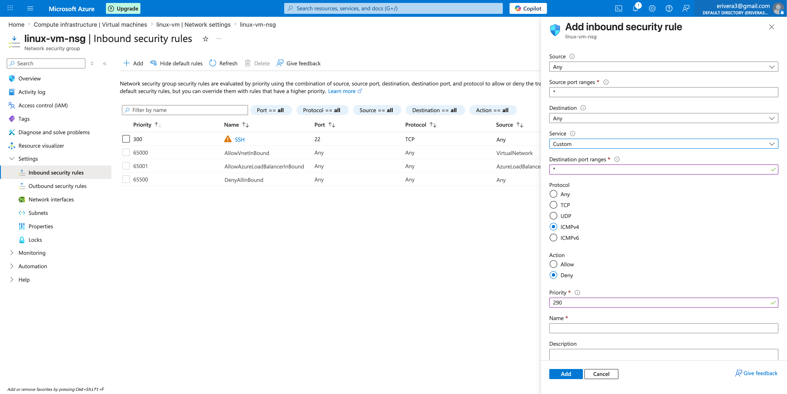

  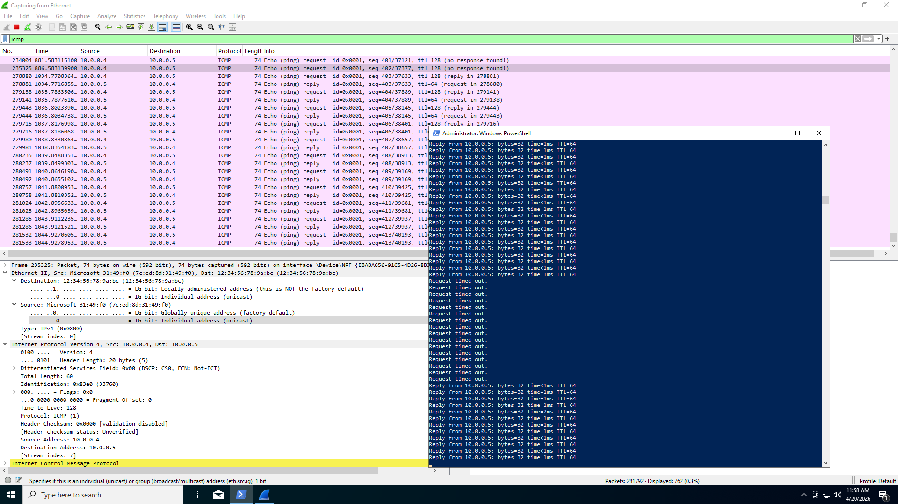

  Connectivity restored after re-enabling ICMP.

<h3>4. SSH Traffic Observation</h3>

<ul>
  <li>Filtered Wireshark for SSH traffic</li>
  <li>Initiated an SSH session from Windows to Ubuntu</li>
  <li>Executed commands within the session</li>
</ul>

  I observed encrypted traffic on port 22, confirming secure remote communication.

  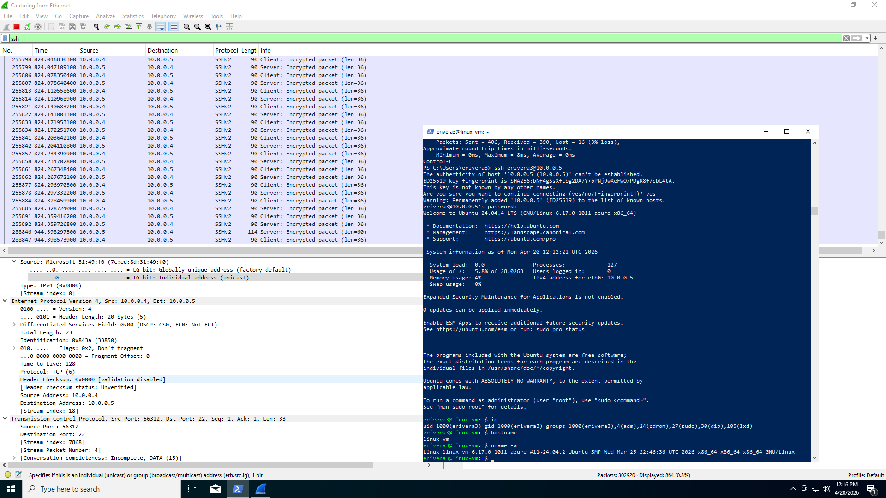

<h3>5. DHCP Traffic Observation</h3>

<ul>
  <li>Filtered Wireshark for DHCP traffic</li>
  <li>Issued a new IP request using:</li>
</ul>

<pre><code>ipconfig /renew</code></pre>

  I observed DHCP request and response packets, demonstrating dynamic IP assignment.

  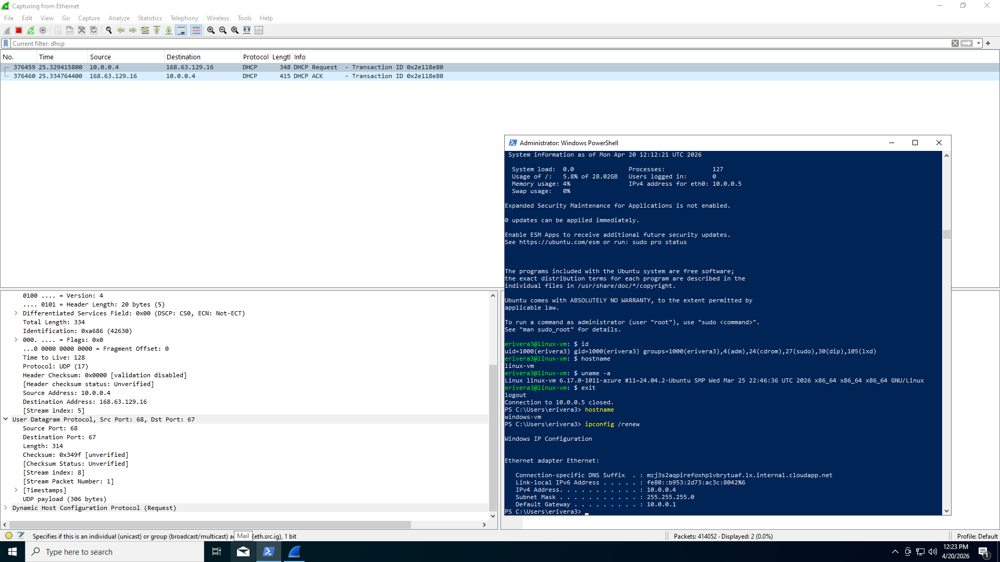

<h3>6. DNS Traffic Observation</h3>

<ul>
  <li>Filtered Wireshark for DNS traffic</li>
  <li>Used:</li>
</ul>

<pre><code>nslookup google.com
nslookup disney.com</code></pre>

  I observed DNS queries and responses, showing how domain names are resolved to IP addresses.

  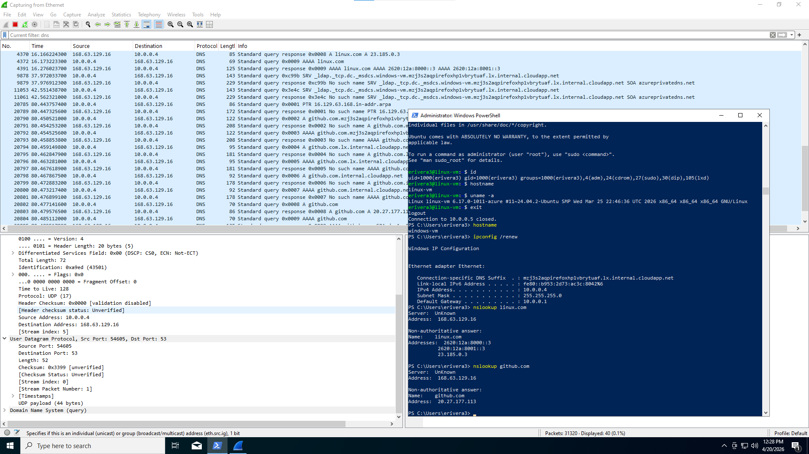

<h3>7. RDP Traffic Observation</h3>

<ul>
  <li>Filtered Wireshark for RDP traffic (<code>tcp.port == 3389</code>)</li>
</ul>

  I observed continuous traffic because Remote Desktop constantly transmits display, input, and session data between systems.

  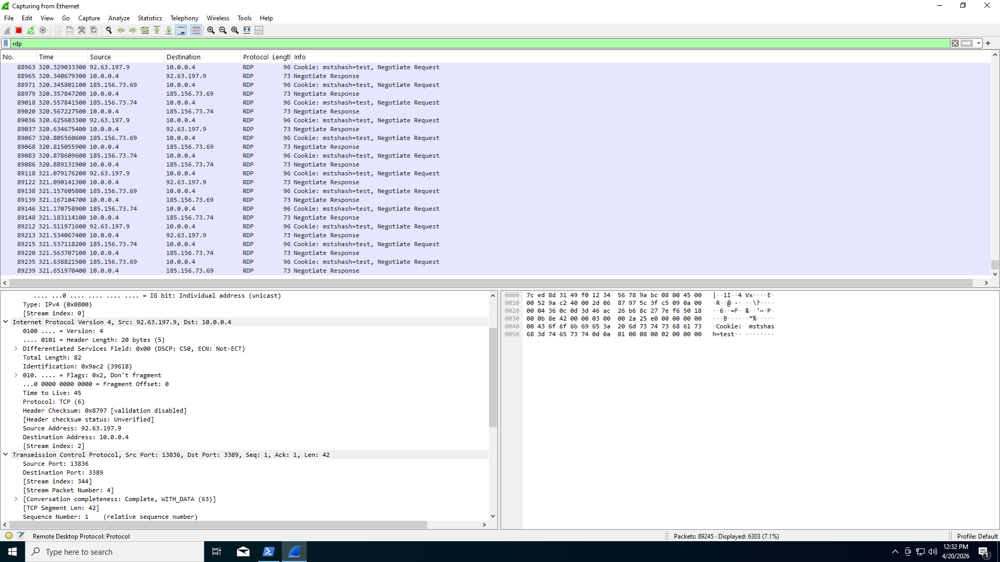

<h2>🔍 Troubleshooting</h2>

<h3>ICMP Blocking Behavior</h3>

<ul>
  <li><strong>Problem:</strong> Ping stopped receiving replies after applying the NSG rule</li>
  <li><strong>Cause:</strong> Inbound ICMP traffic was blocked at the network level</li>
  <li><strong>Fix:</strong> Re-enabled ICMP traffic in the NSG</li>
</ul>

  This demonstrated that traffic can still be sent even when responses are blocked.

<h3>Protocol Visibility</h3>

<ul>
  <li>Initially expected all traffic to behave similarly</li>
  <li>Observed that each protocol has unique patterns:
    <ul>
      <li>ICMP: request/reply</li>
      <li>SSH: encrypted session traffic</li>
      <li>DHCP: broadcast-based communication</li>
      <li>DNS: query/response</li>
      <li>RDP: continuous stream</li>
    </ul>
  </li>
</ul>

  This reinforced the importance of protocol-specific analysis.

<h2>🧠 Design Decisions</h2>

<ul>
  <li>Placed both VMs in the same Virtual Network to enable internal communication</li>
  <li>Used private IP addresses to simulate internal enterprise traffic</li>
  <li>Used continuous ping to clearly observe changes when applying NSG rules</li>
  <li>Used Wireshark instead of relying only on Azure tools to validate actual packet behavior</li>
</ul>

<h2>🛡️ Security Awareness</h2>

<ul>
  <li>NSGs function as cloud-level firewalls controlling inbound and outbound traffic</li>
  <li>Blocking traffic at the network level does not stop packets from being sent, only from being received</li>
  <li>Misconfigured rules can silently block communication without obvious errors</li>
  <li>Understanding traffic patterns helps identify abnormal or malicious activity</li>
</ul>

<h2>🌍 Real-World Relevance</h2>

<ul>
  <li>Network Security Groups are widely used to control access between systems in cloud environments</li>
  <li>Packet analysis tools like Wireshark are essential for diagnosing connectivity issues</li>
  <li>Protocol-level understanding is critical for both IT support and cybersecurity roles</li>
  <li>Troubleshooting requires validating assumptions with real data</li>
</ul>

<h2>📌 Lessons Learned</h2>

<ul>
  <li>Connectivity issues are not always obvious and require step-by-step validation</li>
  <li>Blocking traffic can create one-way communication without clear error messages</li>
  <li>Different protocols behave in fundamentally different ways</li>
  <li>Observing real traffic provides deeper understanding than following configuration steps alone</li>
  <li>Small configuration changes can significantly impact system behavior</li>
</ul>

<h2>💭 Key Takeaways</h2>

  Before this lab, I viewed networking primarily as configuration-based. This project showed that understanding actual traffic behavior is essential for diagnosing issues and validating system functionality.

  By combining traffic visibility with security controls, I was able to better understand how communication between systems is established, interrupted, and restored.

<h2>🧹 Cleanup</h2>

<ul>
  <li>Closed the Remote Desktop session</li>
  <li>Deleted the Resource Group</li>
  <li>Verified that all resources were removed</li>
</ul>

  This ensured no unnecessary cloud resources were left running.

  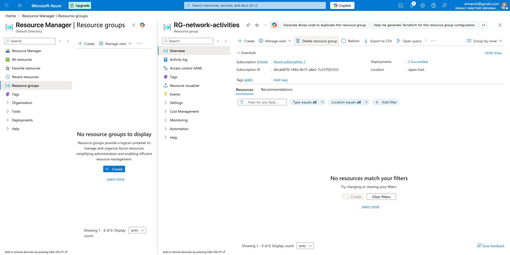

