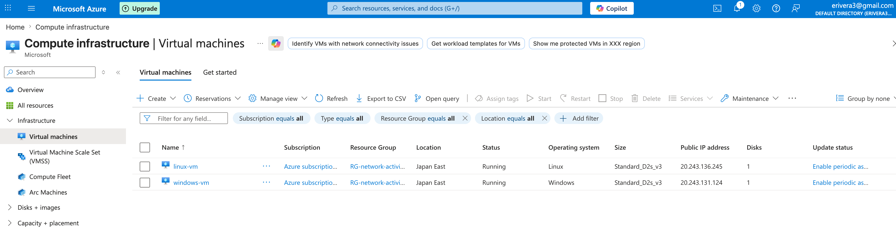
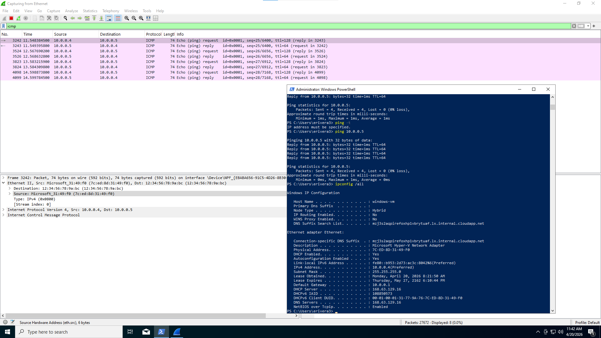
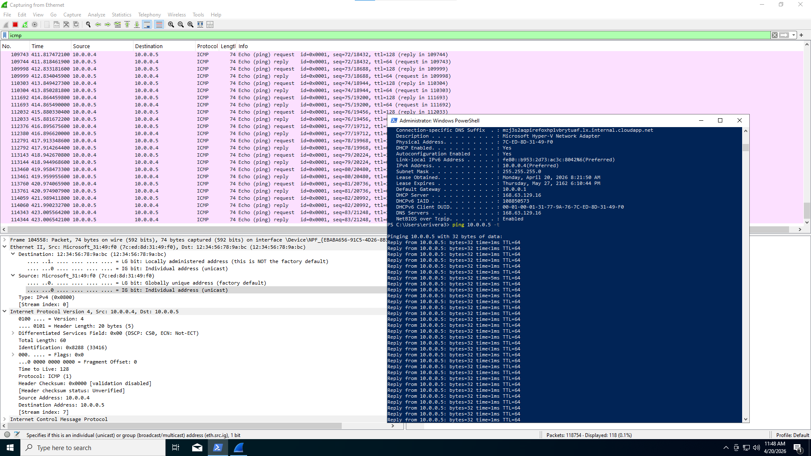
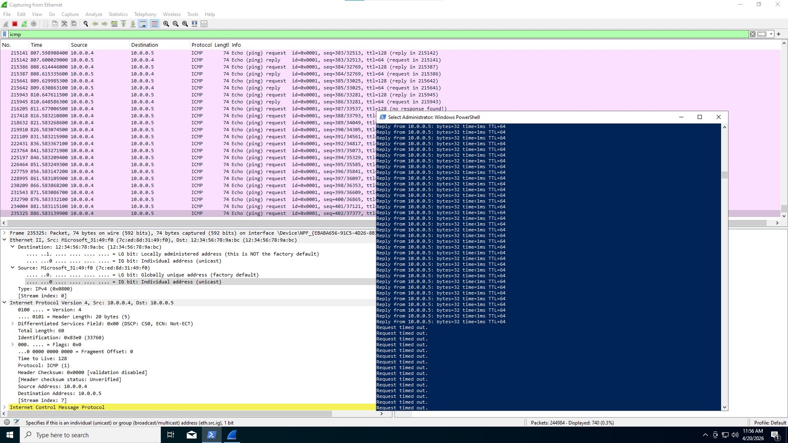
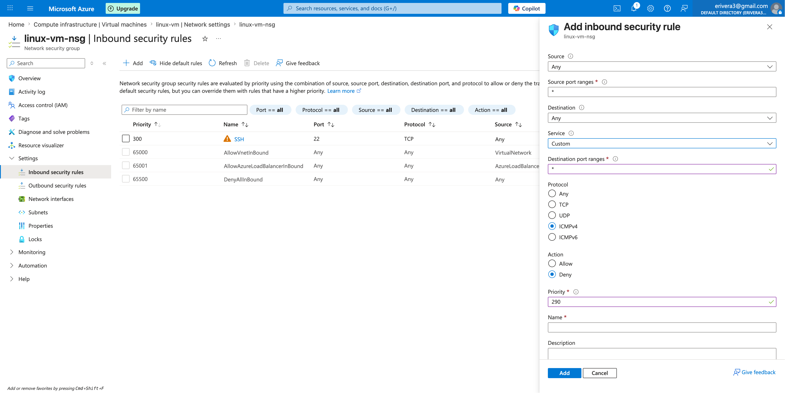
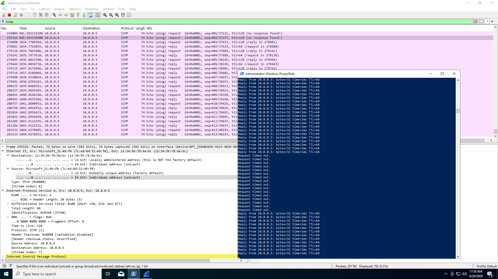
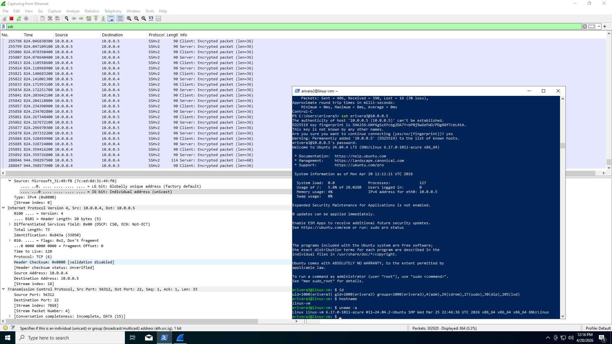
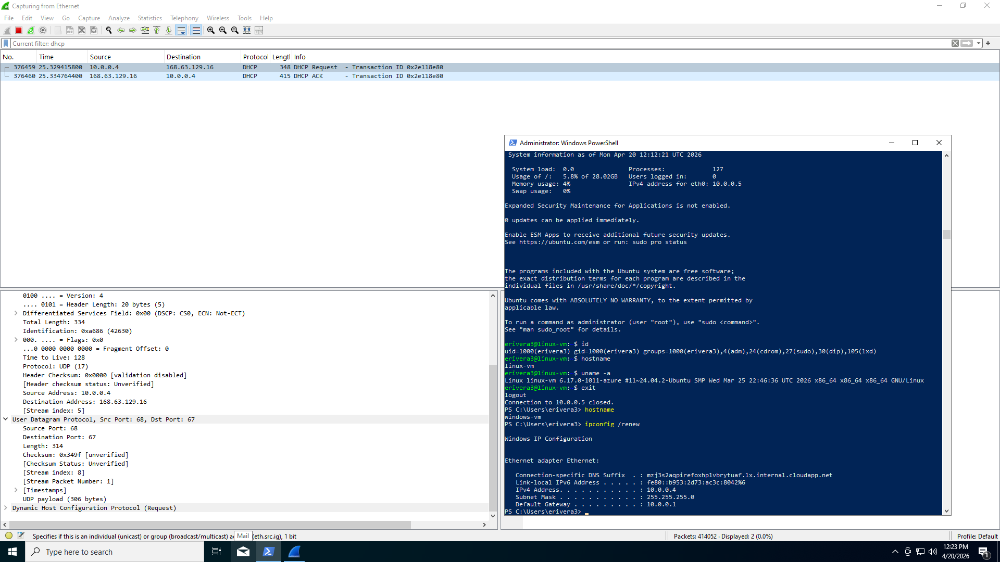
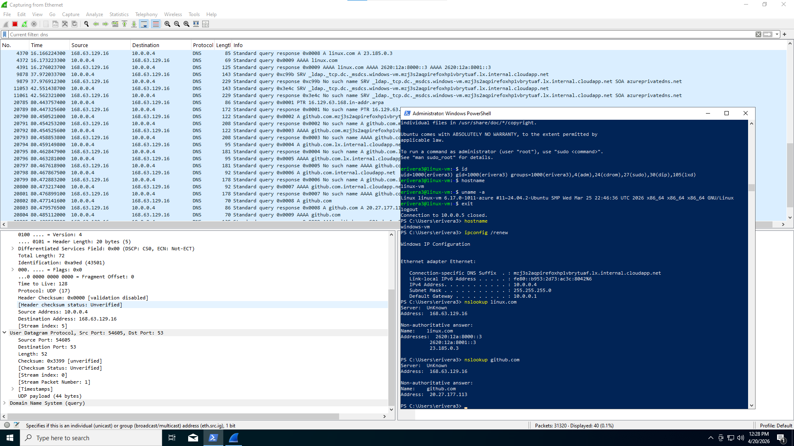
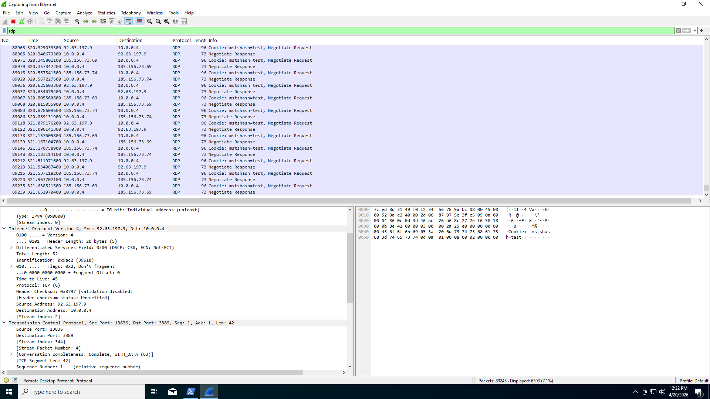

  

<h1 align="center">Network Security Groups & Traffic Inspection (Packet-Level Analysis & Connectivity Control)</h1>

This project focuses on analyzing real network traffic between Azure virtual machines and validating how security rules impact system communication.

The objective was not just to capture packets, but to use traffic analysis to diagnose, break, and restore connectivity under controlled conditions.

---

## 📌 Context

Network communication depends on:

- Protocol behavior (ICMP, SSH, DNS, DHCP, RDP)  
- Network placement (VNet, subnet)  
- Security controls (NSGs)  

Failures at the network level often do not produce clear errors, making packet-level validation critical.

---

## 🧰 Technologies Used

- Microsoft Azure (Virtual Machines)  
- Network Security Groups (NSGs)  
- Wireshark  
- Remote Desktop Protocol (RDP)  
- SSH  
- PowerShell  
- DNS  
- DHCP  
- ICMP  

---

## 💻 Environment

- Windows 10 Virtual Machine  
- Ubuntu Virtual Machine  
- Shared Azure Virtual Network  
- Azure Subnet  
- Network Security Group  
- Wireshark installed on Windows VM  

---

## ⚙️ Implementation

### 1. Infrastructure Setup

**Problem:**  
No controlled environment to test network behavior.

**Decision:**  
Deploy Windows and Ubuntu VMs within the same VNet and subnet.

**Result:**  
- Systems able to communicate via private IP  
- Environment ready for controlled testing  

  

---

### 2. Connectivity Validation (ICMP)

**Problem:**  
Need to confirm baseline communication between systems.

**Decision:**  
Generate ICMP traffic using continuous ping.

**Result:**  
- Successful request/reply cycles observed  
- Connectivity confirmed at network level  

  

---

### 3. NSG Rule Enforcement (Critical Test)

**Problem:**  
Need to validate how security rules affect live traffic.

**Decision:**  
- Apply NSG rule blocking inbound ICMP  
- Maintain continuous ping during change  

**Result:**  
- Requests continued  
- Replies stopped  
- Created one-way communication  

**Insight:**  
Outbound traffic does not guarantee inbound response.  
Security rules can silently break communication.

<table align="center">
  <tr>
    <td align="center">
       
      Working (Before Rule)
    </td>
    <td align="center">
       
      Blocked (After Rule)
    </td>
  </tr>
</table>

  

  

---

### 4. SSH Traffic Analysis

**Problem:**  
Need to observe secure communication behavior.

**Decision:**  
Initiate SSH session and filter traffic.

**Result:**  
- Encrypted traffic observed on port 22  
- Verified secure session behavior  

  

---

### 5. DHCP Behavior Validation

**Problem:**  
Need to understand IP assignment process.

**Decision:**  
Trigger DHCP renewal and capture traffic.

**Result:**  
- Observed request/offer/ack cycle  
- Confirmed dynamic IP allocation  

  

---

### 6. DNS Resolution Analysis

**Problem:**  
Need to validate domain name resolution.

**Decision:**  
Generate DNS queries using `nslookup`.

**Result:**  
- Query/response packets captured  
- Confirmed resolution process  

  

---

### 7. RDP Traffic Behavior

**Problem:**  
Need to understand continuous session traffic.

**Decision:**  
Filter for RDP traffic on port 3389.

**Result:**  
- Continuous traffic observed  
- Confirmed persistent session communication  

  

---

## 🔍 Key Failures & Observations

### One-Way Communication (ICMP Block)
- Cause: NSG blocked inbound traffic  
- Effect: Requests sent, replies dropped  
- Fix: Re-enabled rule  

### Protocol Differences
- ICMP → request/reply  
- SSH → encrypted session  
- DHCP → broadcast  
- DNS → query/response  
- RDP → continuous stream  

---

## 🧠 Decisions That Mattered

- Used continuous ping to observe real-time impact  
- Tested security changes while traffic was active  
- Used Wireshark to validate behavior instead of assuming  
- Focused on cause/effect rather than configuration alone  

---

## 🛡️ System Understanding

- Security rules affect return traffic, not just initial communication  
- Connectivity failures may not generate visible errors  
- Packet analysis is required to validate assumptions  
- Different protocols require different troubleshooting approaches  

---

## 📌 Key Lessons

- Network issues must be validated at the packet level  
- Security controls can silently break communication  
- Protocol behavior determines how issues appear  
- Observing traffic is more reliable than assuming system behavior  

---

## Summary

This project demonstrates the ability to diagnose and validate network behavior using real traffic rather than relying on configuration assumptions.

Key outcomes:

- Identified one-way communication caused by NSG rules  
- Used packet capture to confirm protocol behavior  
- Validated connectivity across multiple protocols  
- Demonstrated how security controls impact real communication  

**Result:**  
A working understanding of how network traffic behaves, how it fails, and how to restore connectivity using packet-level analysis.
